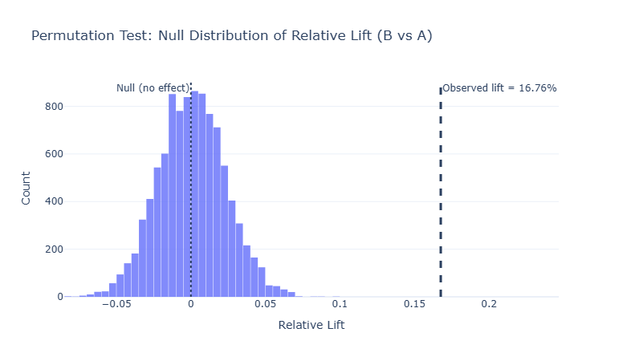
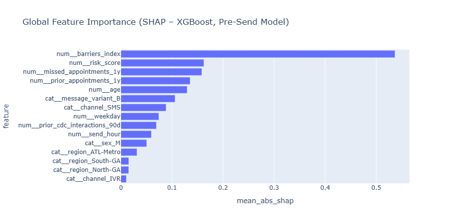
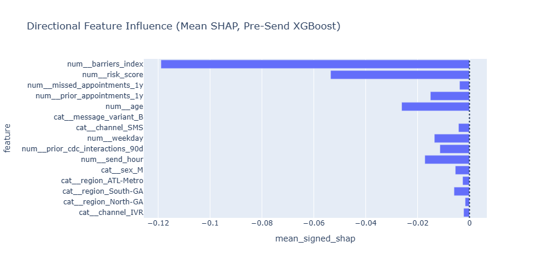
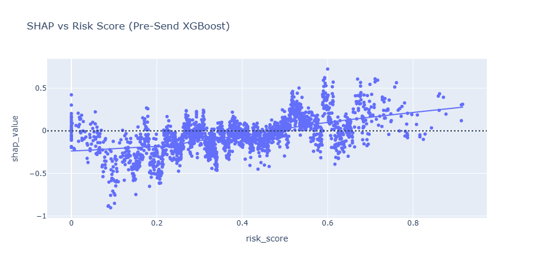

# Public Health A/B Testing & Predictive Analytics (XGBoost)

<p align="center">
  
</p>

**End-to-end experimentation + predictive modeling on simulated CDC-style public health outreach data.**
This project demonstrates how causal experimentation (A/B testing) and predictive modeling (XGBoost + SHAP + uplift targeting) can be combined to design and operationalize data-driven public health outreach strategies.

> **Core focus:** Experimental design, causal thinking, predictive analytics, and ML-driven decision support in a public health / healthcare context.

---

## 🚀 Project Highlights

* **Task:** A/B testing + predictive analytics
* **Domain:** Public health outreach (CDC-style messaging campaigns)
* **Experiment:** Permutation-based A/B testing
* **ML:** XGBoost classification for pre-send scheduling prediction
* **Tech Stack:** Python, Pandas, NumPy, Plotly, Scikit-learn, XGBoost
* **Outputs:** Statistical testing, uplift visualization, reproducible notebooks, SHAP interpretability

---

## 🧠 Motivation & Problem Statement

Public health agencies often deploy large-scale outreach campaigns (SMS, email, IVR) to encourage preventive care such as vaccination scheduling. However, choosing which message strategy to deploy at scale—and to whom—is non-trivial.

**Key questions:**

* Does a personalized message outperform a standard reminder?
* How large is the uplift?
* Which population segments are most likely to respond?
* Can we predict engagement to optimize future campaigns?

This project simulates a randomized CDC-style outreach experiment and applies:

* **Permutation testing** to quantify causal impact
* **Predictive modeling (XGBoost)** to forecast scheduling behavior and support targeting

---

## 🔬 A/B Testing Methodology (Permutation Test)

Instead of relying on parametric assumptions, this project uses a **permutation test** to construct the null distribution of lift under random assignment:

**Steps:**

1. Compute observed lift: `Lift = (p_B - p_A) / p_A`
2. Shuffle treatment labels thousands of times
3. Recompute lift for each shuffle
4. Estimate p-value as the probability of observing a lift as extreme as the real one
5. Visualize the null distribution with Plotly

This approach:

* Requires minimal assumptions
* Is robust and interpretable
* Mirrors real-world experimentation workflows

---

## 📈 Results: A/B Test (Permutation Test)

### Key Metrics

* **Control rate (A):** 26.30% (nA = 10,021)
* **Treatment rate (B):** 30.71% (nB = 9,979)
* **Absolute lift:** +4.41 percentage points
* **Relative lift:** **+16.76%**

> Relative lift is computed as:
> `Lift = (p_B - p_A) / p_A`

### Statistical Significance (Permutation Test)

Because the permuted lifts are centered around **0 (no effect)**, the observed relative lift of **~16.8%** lies far in the right tail of the null distribution, resulting in a **p-value close to 0**.

**Interpretation:**
The personalized treatment message (Variant B) had a **meaningful positive causal effect** on scheduling rates compared to the standard reminder (Variant A).

<p align="center">
  
</p>

---

## 🧪 Synthetic Dataset Generation (CDC-Style Outreach Simulation)

This project uses a **synthetically generated dataset** produced by a reproducible generator (`src/ab_test_data_generator.py`) that encodes plausible behavioral and operational dynamics observed in real-world healthcare outreach campaigns.

**Design highlights:**

* Realistic demographics and regions
* Health risk (`risk_score`) and access barriers (`barriers_index`)
* Prior engagement history
* Randomized treatment assignment
* Behavioral funnel: open → click → schedule (7d) → complete (30d)
* Heterogeneous treatment effects across subgroups

> **Note:** The dataset is synthetic and used strictly for demonstration and portfolio purposes.

---

## 🏹 Predictive Analytics (XGBoost – Pre-Send Targeting)

A **pre-send XGBoost classifier** predicts the probability of scheduling within 7 days (`scheduled_7d`) using only features available **before message delivery** (no opens/clicks), preventing label leakage and reflecting realistic deployment constraints.

**Setup:**

* **Target:** `scheduled_7d`
* **Features:** demographics, region, channel, timing, risk, barriers, prior engagement, message variant
* **Preprocessing:** one-hot encoding + numeric passthrough
* **Imbalance handling:** class weighting + threshold tuning (recall-oriented)
* **Evaluation:** ROC-AUC (ranking) + recall (coverage)
* **Interpretability:** SHAP (global, directional, dependence)

### 🔍 Global Feature Importance (Mean |SHAP|)

<p align="center">
  
</p>

**Interpretation:**
Access barriers dominate importance, followed by health risk and prior engagement. Message variant and channel matter, but structural access constraints are the primary bottleneck to follow-through.

### ➕➖ Directional Feature Influence (Mean Signed SHAP)

<p align="center">
  
</p>

**Interpretation:**
Higher access barriers suppress predicted scheduling, while higher health risk and Message B increase predicted likelihood on average. Mean signed SHAP aggregates heterogeneous effects; dependence plots clarify directionality.

### 📈 SHAP Dependence: Risk Score

<p align="center">
  
</p>

**Interpretation:**
The relationship is **nonlinear**: low-risk individuals are less likely to schedule, while higher-risk individuals increasingly benefit, supporting risk-prioritized outreach.

---

## 🎯 Uplift Targeting (Operational Use)

The model supports **counterfactual targeting**:

* Predict `p_A` and `p_B`
* Compute **uplift = p_B − p_A**
* Rank individuals by uplift to allocate Message B under budget constraints

---

## 🎯 Actionable Insights

1. **Pair messaging with barrier reduction** (transport, extended hours)
2. **Prioritize high-risk populations** for personalized outreach
3. **Use multi-touch strategies** for poor adherence groups
4. **Allocate limited resources via uplift ranking**

---

## ▶️ How to Run

```bash
conda env create -f datasci_xgb_skl_env001.yml
conda activate datasci_xgb_skl_env001
jupyter notebook
```

Run:

* `01_data_generation_and_AB_testing.ipynb`
* `02_predictive_analytics_xgboost.ipynb`

---

## ⚠️ Disclaimer

This project is for **portfolio and educational purposes only**.
The dataset used in this project is **synthetic** and does **not** represent real CDC data or real individuals.

---

## 👤 Author

**Husayn El Sharif**
Senior Data Scientist / Machine Learning Engineer

---

## 📌 Portfolio Relevance

* Causal experimentation
* A/B Testing
* Permutation-based inference
* SHAP interpretability
* Uplift targeting
* Public health analytics framing